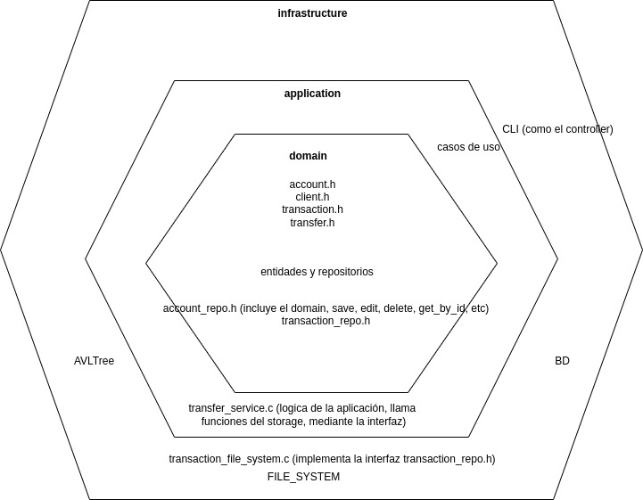

# Simple banking system written in C
## _for fun and learn about networks, unix, files and data structures_

## Features

Now I have got a good prototype, our SYSBANSI is able to:

- Create accounts (including client creation)
- Log in in the bank system using document and password
- Transfer money between accounts
- List transactions with some details

## Future characteristics

Simple banking system will be able to execute the following operations (all operations at the file level) through CLI:

- [x] Create account (including clients creation if it does not exist)
- [x] Log in in the bank system using document and password
- [ ] deposit money to an account
- [ ] withdraw the money from the accounts
- [x] Transfer money to another account
- [x] List transactions with some details
- [ ] keep login bucle
- [ ] service or daemon to maintain an AVL tree in memory
- [ ] AVL tree
- [ ] communication between CLI and SERVER (service or daemon) through sockets (Like Redis o Docker)
- [ ] config for the banking core like port
- [ ] threads for multiuser
- [ ] change file persistence to database persistence (postgreSQL or other)

Previous operations include the generation of the transaction record.

## Hexagonal Architecture

This is the approximate architecture that I am using for the project. I wanted it to be a project with a couple of details.





## Usage

_Nota: The user document and password are the same. You can use the next users: 123, 234, 345_

Right now the usage is simple, the code was developed on Linux and Mac Os, so I'm unsure if it will run on Windows. Feel free to give it a try.

Clone project

```sh
git clone https://github.com/berracode/simple-banking-system.git
```

Go to source code's directory:


```sh
cd simple-banking-system
```

Ensure that you have  `gcc ` o  `g++ ` and  `make ` and then execute:

```sh
make
```

and finally

```sh
./bin/sysbansi
```


## License

MIT

**Free Software, Hell Yeah!**